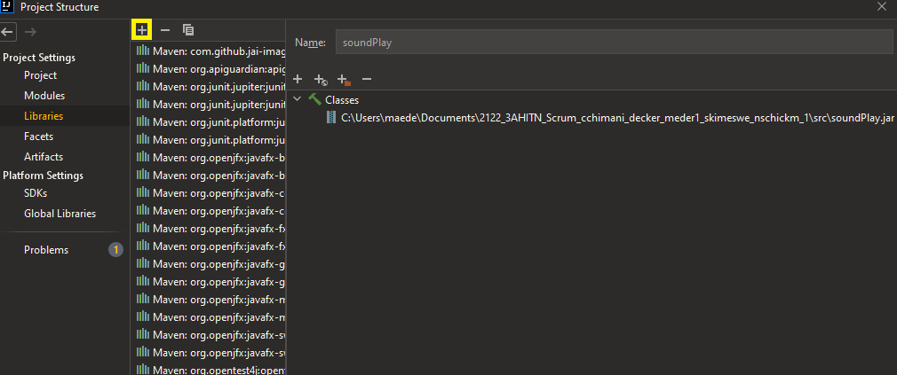
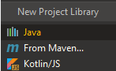
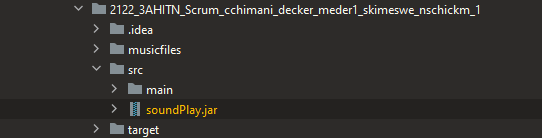

# 2122_3AHITN_Scrum_cchimani_decker_meder1_skimeswe_nschickm

| Rolle          | Name            | Git-Account                       | E-Mail                          |
|----------------|-----------------|-----------------------------------|---------------------------------|
| Product-Owner | Wittner Michael | https://github.com/michaelwittner | michael.wittner@htl-steyr.ac.at |
| Scrum-Master     | Eder Manuel     | https://github.com/manuelederr    | meder1@htl-steyr.ac.at          |
| Entwickler     | Ecker David     | https://github.com/decker213      | decker@htl-steyr.ac.at          |
| Entwickler     | Kimeswenger Simon     | https://github.com/skimeswe      | skimeswe@htl-steyr.ac.at          |
| Entwickler     | Schickmair Nico     | https://github.com/nschickm      | nschickm@htl-steyr.ac.at          |
| Entwickler     | Chimani Christian     | https://github.com/christian-42      | cchimani@htl-steyr.ac.at          |

##Potentielle Fehler und Fixes dafür

###SoundPlay.jar Fehler

Project Structure -> Libraries

 

SoundPlay.jar auswählen

